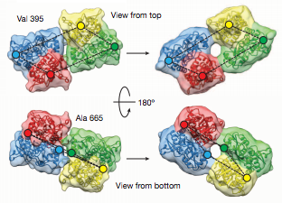
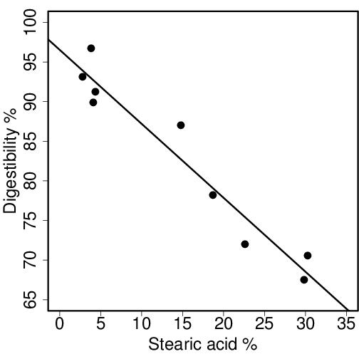
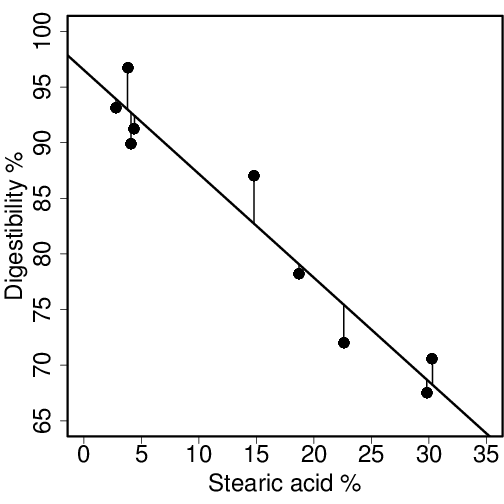
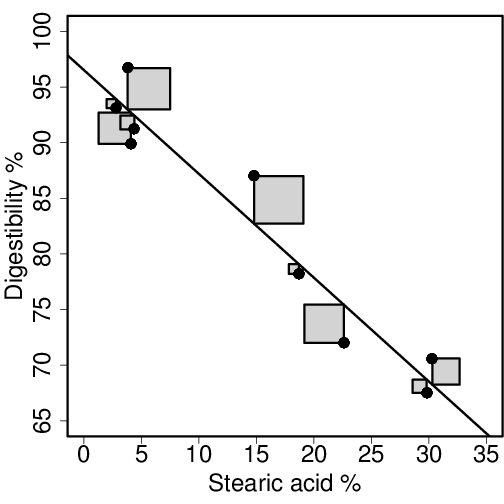
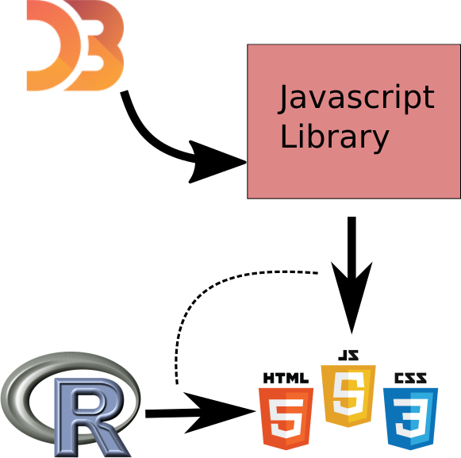
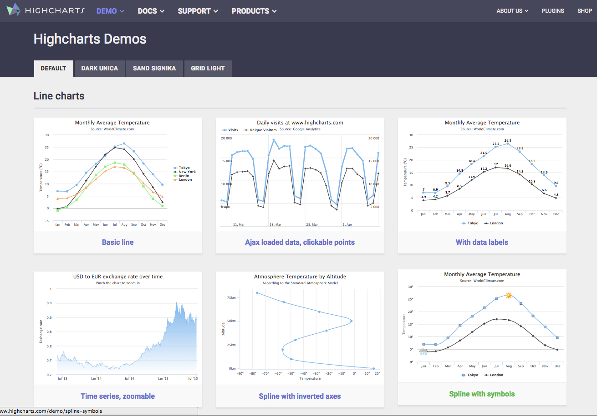

## Why? Presenting research results {.flexbox .vcenter}

<script src="http://ajax.googleapis.com/ajax/libs/jquery/1.9.1/jquery.min.js"></script>

```{r setup, include=FALSE}
knitr::opts_chunk$set(echo = FALSE)
```


```{r, out.width = 600, fig.retina = NULL}

```

Nature, October 2014


## Why? Teaching {.columns-2}

Least squares estimation

Linear regression model

$$
y_i = \alpha + \beta x_i + \epsilon
$$

Estimates for the intercept and slope can be found by minimizing the squared residuals.

$$
\arg\min_{\alpha, \beta} \sum_i \left(y_i - (\alpha + \beta x_i) \right)^2
$$

<br><br><br><br>


```{r, out.width = 400, fig.retina = NULL}

```


## Why? Teaching {.centered}

```{r, out.width = 500, fig.retina = NULL}

```

## Why? Teaching {.centered}

```{r, out.width = 500, fig.retina = NULL}

```

## Why? Teaching {.centered}

```{r, out.width = 500, fig.retina = NULL}

```

## Why? Teaching

Slidify

```{r eval=FALSE, echo=TRUE}
library(shiny)
runGitHub('ekstroem/ShinyLeastSquares')
```


The "role" of graphics is changing and expanding


## Background { .columns-2 .center }

### **Toby**

```{r, out.width = 150, fig.retina = NULL}

```

 - Dept. XXX, XXX
 - R packages: `animint `
 - Some other nice info. 
 - Change pic?

<br><br><br>

### **Claus** 

```{r, out.height = 150, fig.retina = NULL}

```

 - Dept. Biostatistics, UCPH
 - R packages: ` MESS `, ` MethComp `, ` SuperRanker `, ...
 - R book: The R Primer
 - Happy/**frustrated** interactive graphics enthusiast


## Outline for the tutorial { .smaller }

|Topic | Time |
|------+------|
| Introduction | 15 minutes |
| Highlevel interactive graphics (javascript libraries) | **35 minutes** |
| Interactive graphics (shiny, ggplotly) | **35 minutes** |
| *Break* ||
| Multi layer/-panel graphics | **30 minutes** |
| Animated graphics | **30 minutes** |
| Putting it all together  | **30 minutes** |

**Tutorial goals:**

1. Explain and emphasize the role that interactive graphics have in reporting, scientific journals, and in teaching.
2. Give overview of existing R packages for interactive graphics. 
3. Explain the strengths and weaknesses of the existing R packages, to highlight directions for future work.


## Necessary stuff

Necesary packages etc XXX To be filled out at the end

Rstudio

See also: Toby's link

devtools::install_github("ramnathv/rCharts")


## Concepts

Tobys slides terms / discussion

 - multi-layer, multi-panel, multi-plot
 - animation, direct manipulation (clicking, hovering), indirect manipulation (buttons, menus)
 - zoom, highlight, show/hide (data, labels, tooltips)
 
## An example of 1

## An example of 2

## An example of 3


## The role of the graphics/viewer

<div class="centered">
```{r, out.height = 250, fig.retina = NULL}
knitr::include_graphics("img/napoleon.jpg")
```
</div>
<div class="columns-2">
```{r out.height=200, out.width = 500}
library(DiagrammeR)
grViz("
  digraph neato {

    rankdir=LR;
    node[width=.4,height=.4,fixedsize=true];
    { rank=same; A ; B} 

    node [shape = circle]
    A -> {B} 
    B -> {C} 

    A[label='Data',shape=circle,fillcolor='lightblue',style='filled', fontsize=8];
    B[label='Researcher',shape=circle,fillcolor='lightblue',style='filled', fontsize=8];
    C[label='Viewer',shape=circle,fillcolor='lightblue',style='filled', fontsize=8];

  }")
```
```{r out.height=200, out.width = 500}
library(DiagrammeR)
grViz("
  digraph neato {

    rankdir=LR;
    node[width=.4,height=.4,fixedsize=true];
    { rank=same; A ; B} 

    node [shape = circle]
    A -> {B C} 
    B -> {C} 
    B -> {C} 
    B -> {C} 

    C -> {A}
    A[label='Data',shape=circle,fillcolor='lightblue',style='filled', fontsize=8];
    B[label='Researcher',shape=circle,fillcolor='lightblue',style='filled', fontsize=8];
    C[label='Viewer',shape=circle,fillcolor='lightblue',style='filled', fontsize=8];


  }")
```
</div>


## Interactive graphics architechture { .center }

<div class="centered">
```{r out.width = 650}
grViz("
  digraph neato {

    rankdir=LR;
    node[width=1,height=1,fixedsize=true];

    edge[weight=20];
    A -> B ;
    B -> A ;

    edge[weight=1];

    A -> { A }
  
    A[label='Client/\nuser',shape=circle,fillcolor='lightblue',style='filled'];
    B[label='Server',shape=circle,fillcolor='lightblue',style='filled'];
  }")
```
</div>
- Distribution and viewing
- Dedicated server vs. local server 


# Javascript-based libraries (htmlwidgets)

## R and Javascript architecture { .columns-2 }

<div class="centered">
```{r, out.height = 100, fig.retina = NULL}
knitr::include_graphics("img/Logo_D3.png")
```
</div>

[D3.js](https://d3js.org/) doesn’t ship with any pre-built charts out of the box. However, go to website to get an overview of the possibilities.

- ChartJS
- Chartist.js
- [n3]
- [plotly](https://plot.ly/)


<div class="centered">
```{r, out.height = 400, fig.retina = NULL}

```
</div>


## Highlevel interactive graphics { .columns-2 .smaller }

 Numerous possibilities in R packages
 
 - **rCharts**  (oldish - mix of libraries)
 - **highcharter** (standard plot types, mature library)
 - [**dygraphs**](https://rstudio.github.io/dygraphs/) (mostly time series. well documented. Rich features) 
 - **metricsgraphics** (also time series)
 - **leaflet** (maps)
 - **plotly** (general plots - like ggplot)
 - [**htmlwidgets**](http://www.htmlwidgets.org/) Javascript framework (many are part of this). Super important!
 
 <br><br> <br><br>

<div class="centered">
```{r, out.height = 200, fig.retina = NULL}
knitr::include_graphics("img/frustration20logo.jpg")
```
</div>
 
- No standard interface
- Not easily extendable from R 
- Pick a library and learn it!

## rCharts interfaces { .smaller }

| library  | function |            |
|:---------|----------|------------|
|[polychart](http://www.polychart.com/js/) | rPlot    | ggplot2-like |
|[Morris](http://morrisjs.github.io/morris.js/)    | mPlot    | Pretty time series |
|[nvd3](http://nvd3.org)      | nPlot    | Lines/areas/bars |
|[xCharts](http://tenxer.github.io/xcharts/)   | xPlot    | Various graphs |
|[Highcharts](http://www.highcharts.com/)| hPlot    | Interactive charts |
|[Leaflet](http://leafletjs.com/)   |  new()   | Interactive Maps |
|[Rickshaw](http://code.shutterstock.com/rickshaw/)  |  new()   | Real-time ts graphs |
|[Dimple](http://www.dimplejs.org)    | dPlot    | Business analytics |


## polychart (from rCharts) { .columns-2 .smaller }

`plot`/`lattice`-like function.


```{r warning=FALSE, echo=TRUE, message=FALSE, eval=FALSE, out.width = 400}
library(rCharts)
library(MESS)
data(happiness)
mydf <- happiness
mydf$size <- sqrt(mydf$population)/8
r1 <- rPlot(x = "tax", 
            y = "happy", 
            data = mydf, 
            type = "point", 
            color = "continent", 
            size = "size")
r1
```

Type: bar, layers, ...


```{r warning=FALSE, results='asis', message=FALSE, echo=FALSE, out.width=400}
library(rCharts)
library(MESS)
data(happiness)
mydata <- happiness
mydata$size <- sqrt(mydata$population)/8
r1 <- rPlot(x = "tax", y = "happy", data = mydata, type = "point", 
            color = "continent", size = "size")
r1$addParams(width = 400, height = 500)
#h1 <- hPlot(x = "tax", y = "happy", data = mydata, type = "bubble", 
#            group = "continent", size = "size")
r1$show('inline', include_assets = TRUE)
#r1
```


## polychart (from rCharts) { .columns-2 .smaller }

`plot`/`lattice`-like function. Add layers and guides to plot ..

```{r warning=FALSE, echo=TRUE, message=FALSE, eval=FALSE}
mydf2 <- data.frame(tax=c(1, 50), 
                happy=c(4.93, 7.09))

r1$layer(x = "tax", 
         y = "happy", 
         data = mydf2, 
         type = "line",
         size=list(const=4))

r1$guides(y = list(title="New label", 
                   min=0, max=12))

r1
```

- `layer`  $\approx$ points/lines
- `guides` $\approx$ axis
- `addParams` $\approx$ title, plot size


```{r warning=FALSE, results='asis', message=FALSE, echo=FALSE}
mydf2 <- data.frame(tax=c(1, 50), happy=c(4.93976, 7.09233))

r2 <- rPlot(x = "tax", y = "happy", data = mydata, type = "point", 
            color = "continent", size = "size")
r2$addParams(width = 400, height = 500)

r2$layer(x = "tax", 
         y = "happy", 
         data = mydf2, 
         type = "line",
         size=list(const=4))

r2$guides(y = list(title = "New label", 
                   min=0, max = 12))

r2$show('inline', include_assets = TRUE)

```


## polychart - tooltips { .columns-2 .smaller }

```{r warning=FALSE, message=FALSE, echo=TRUE, eval=FALSE}

r3 <- rPlot(x = "tax", y = "happy", 
      data = mydf, type = "point", 
      color = "continent", 
      size = "size", 
      tooltip="#!function(item){ 
return ('Country: ' +item.country+ 
        '&#013; Tax: ' +item.tax+ 
        '% Happiness: ' +item.happy+
        '<br> Pop: ' +item.population+ 
        ' mio.') }!#")  

```

Passing javascript is non-trivial.

```{r results = 'asis', commment = NA, message = FALSE, echo = FALSE, warning=FALSE}
mydf <- happiness
mydf$size <- sqrt(mydf$population)/8

r3 <- rPlot(x = "tax", y = "happy", 
      data = mydf, type = "point", 
      color = "continent", 
      size = "size", 
      tooltip="#!function(item){ 
return ('Country: ' +item.country+ 
        '&#013; Tax: ' +item.tax+ 
        '% Happiness: ' +item.happy+
        '<br> Pop: ' +item.population+ 
        ' mio.') }!#")  

r3$addParams(width = 400, height = 500)


r3$show('inline', include_assets = TRUE)

```


## [Highcharts](http://jkunst.com/highcharter/index.html)



## highcharter {.columns-2 .smaller }

```{r}
knit_print.htmlwidget <- function(x, ..., options = NULL){ 
  options(pandoc.stack.size = "2048m") 
  wdgtclass <- setdiff(class(x), "htmlwidget")[1] 
  wdgtrndnm <- paste0(sample(letters, size = 7), collapse = "") 
  wdgtfname <- sprintf("wdgt_%s_%s.html", wdgtclass, wdgtrndnm) 
  htmlwidgets::saveWidget(x, file = wdgtfname, selfcontained = TRUE, background = "transparent") 
  iframetxt <- sprintf("<iframe frameBorder=\"0\" src=\"%s\" width=\"100%%\" height=\"600\"></iframe>", wdgtfname)  
  knitr::asis_output(iframetxt) 
} 

```

Mature charts, stocks (time series), maps. Good API.

- Start with empty chart and add components.
- (Mostly) no default arguments

```{r echo=TRUE,eval=FALSE}
library(highcharter)
hc <- highchart() %>% 
  hc_chart(type = "column") %>% 
  hc_title(text = "Denmark") %>% 
  hc_xAxis(categories = 2011:2016) %>% 
  hc_add_series(data = c(3806,  6184,  
                         7557, 14792, 
                         21315, 3016),
          name = "Asylum seekers") %>% 
  hc_add_serie(name = "Syria", 
               data = c(429, 822, 
                      1710, 7087, 
                       8608, 777),
               type = "spline")
hc
```

<br><br><br><br>

```{r echo=FALSE, eval=TRUE}
library(highcharter)
hc <- highchart() %>% 
  hc_chart(type = "column") %>% 
  hc_title(text = "Denmark") %>% 
  hc_xAxis(categories = 2011:2016) %>% 
  hc_add_series(data = c(3806,  6184,  
                         7557, 14792, 
                         21315, 3016),
          name = "Asylum seekers") %>% 
  hc_add_series(name = "Syria", 
               data = c(429, 822, 
                      1710, 7087, 
                       8608, 777),
               type = "spline")

hc
```

## Highcharter - adding data { .smaller }

Data are added using one of the following functions

| Name |  Function |
|----------+-----|
| hc_add_series | Add single series (named: `data`, `name`) |
| hc_add_series_list | Add *list* named series |
| hc_add_series_df | Add data.frame. Name variables accordingly |
| hc_add_series_ts | Add ts object. Extra argument: `name` |
| hc_add_series_scatter | Crate scatter from two vectors. Extra arguments (size, color, label) | 
| hc_add_series_boxplot | Add boxplots |
| hc_add_series_map | Add geojson map |


## Highcharter function overview { .smaller }

| Function | Example |
|--------+----------|
| Title  | hc_title(text = "Temperature") | 
| Subtitle  | hc_subtitle(text = "Somewhere warm") | 
| Axis   | hc_xAxis(categories = month) | 
|        | hc_yAxis(title = list(text = "Temperature"), labels = list(format = "{value} C")) |
| Theme  | hc_add_theme(hc_theme_sandsignika()) |
| Zoom   | hc_chart(zoomType = "xy") |
| Tooltip | hc_tooltip(useHTML = TRUE, headerFormat="&lt;table&gt;", |
|         | pointFormat = "&lt;tr&gt;&lt;th&gt;x-val&lt;/th&gt;&lt;td&gt;{point.x}&lt;/td&gt;&lt;/tr&gt;" |
|         | footerFormat = "&lt;/table&gt;") |
| Legend  | hc_legend(enabled=FALSE) |
| Credits | hc_credits(enabled = TRUE, text = "Source: Wikipedia", href = "https://wikipedia.com", style = list(fontSize = "12px")) |


## Highcharter - adding information


```{r echo=TRUE, eval=FALSE}
happiness$size <- sqrt(happiness$population)/8

happy2 <- highchart() %>% 
  hc_title(text = "Taxes and happiness") %>% 
  hc_subtitle(text = "Source: Wikipedia") %>% 
  hc_xAxis(title = list(text = "Taxation (%)")) %>% 
  hc_yAxis(title = list(text = "Happiness")) %>% 
  hc_chart(zoomType = "xy") %>% 
  hc_add_serie_scatter(happiness$tax, happiness$happy,
                       happiness$size, happiness$continent,
                       happiness$country,
                       dataLabels = list(
                         enabled = TRUE,
                         format = "{point.label}"
                       ),
                       extrainfo = sprintf("Mostly %s", happiness$religion)
                       ) %>%
  hc_tooltip(useHTML = TRUE,
             headerFormat = "<table>",
             pointFormat = paste("<tr><th colspan=\"1\"><b>{point.label}</b></th></tr>",
                                 "<tr><th>Weight</th><td>{point.x} lb/1000</td></tr>",
                                 "<tr><th>MPG</th><td>{point.y} mpg</td></tr>",
                                 "<tr><th>Drat</th><td>{point.z} </td></tr>",
                                 "<tr><th>HP</th><td>{point.valuecolor} hp</td></tr>",
                                 "<tr><th>HP</th><td>{point.extrainfo} hp</td></tr>"),

             footerFormat = "</table>")
happy2
```


## Highcharter - adding information


```{r}
happiness$size <- sqrt(happiness$population)/8

happy2 <- highchart() %>% 
  hc_title(text = "Taxes and happiness") %>% 
  hc_subtitle(text = "Source: Wikipedia") %>% 
  hc_xAxis(title = list(text = "Taxation (%)")) %>% 
  hc_yAxis(title = list(text = "Happiness")) %>% 
  hc_chart(zoomType = "xy") %>% 
  hc_add_serie_scatter(happiness$tax, happiness$happy,
                       happiness$size, happiness$continent,
                       happiness$country,
                       dataLabels = list(
                         enabled = TRUE,
                         format = "{point.label}"
                       ),
                       extrainfo = sprintf("Mostly %s", happiness$religion)
                       ) %>%
  hc_tooltip(useHTML = TRUE,
             headerFormat = "<table>",
             pointFormat = paste("<tr><th colspan=\"1\"><b>{point.label}</b></th></tr>",
                                 "<tr><th>Weight</th><td>{point.x} lb/1000</td></tr>",
                                 "<tr><th>MPG</th><td>{point.y} mpg</td></tr>",
                                 "<tr><th>Drat</th><td>{point.z} </td></tr>",
                                 "<tr><th>HP</th><td>{point.valuecolor} hp</td></tr>",
                                 "<tr><th>HP</th><td>{point.extrainfo} hp</td></tr>"),

             footerFormat = "</table>")
happy2
```

## Highcharter - adding information

More on functions?


## dygraphs


## dygraphs { .columns-2 }

Same build-up as highcharter

```{r echo=TRUE, eval=FALSE}
library(dygraphs)
head(nhtemp)
dygraph(nhtemp, main = "New Haven Temperatures") %>% 
  dyRangeSelector(dateWindow = c("1920-01-01", "1960-01-01"))
```

<br><br><br><br>

```{r echo=FALSE, eval=FALSE}
library(dygraphs)
dygraph(nhtemp, main = "New Haven Temperatures") %>% 
  dyRangeSelector(dateWindow = c("1920-01-01", "1960-01-01"))
```


## dygraphs 2 { .columns-2 }

```{r}
library(dygraphs)
hw <- HoltWinters(ldeaths)
predicted <- predict(hw, n.ahead = 72, prediction.interval = TRUE)

dygraph(predicted, main = "Predicted Lung Deaths (UK)") %>%
  dyAxis("x", drawGrid = FALSE) %>%
  dySeries(c("lwr", "fit", "upr"), label = "Deaths") %>%
  dyOptions(colors = RColorBrewer::brewer.pal(3, "Set1"))
```  


## dygraphs functions

| Function | Example |
|--------+----------|
| Title  | hc_title(text = "Temperature") | 
| Subtitle  | hc_subtitle(text = "Somewhere warm") | 
| Axis   | hc_xAxis(categories = month) | 
|        | hc_yAxis(title = list(text = "Temperature"),
           labels = list(format = "{value}? C")) |
| Theme  | hc_add_theme(hc_theme_sandsignika()) |
| Zoom   | hc_chart(zoomType = "xy") |
| Tooltip | hc_tooltip(useHTML = TRUE, headerFormat="<table>", |
|         | pointFormat = "<tr><th>x-val</th><td>{point.x}</td></tr>" |
|         | footerFormat = "</table>") |
| Legend  | hc_legend(enabled=FALSE) |
| Credits | hc_credits(enabled = TRUE, text = "Source: Wikipedia",
             href = "https://wikipedia.com",
             style = list(fontSize = "12px")) |


## metricsgraphics

```{r}
library(htmlwidgets)
library(metricsgraphics)
library(RColorBrewer)
mtcars %>%
  mjs_plot(x=wt, y=mpg, width=600, height=500) %>%
  mjs_point(color_accessor=cyl,
            x_rug=TRUE, y_rug=TRUE,
            size_accessor=carb,
            size_range=c(5, 10),
            color_type="category",
            color_range=brewer.pal(n=11, name="RdBu")[c(1, 5, 11)]) %>%
  mjs_labs(x="Weight of Car", y="Miles per Gallon") %>%
  mjs_add_legend(legend="X")
```

Should be the same as before (happyness)

## Metricgraphics

## Metricgraphics


```{r eval=FALSE, echo=TRUE}
library(RColorBrewer)

tmp <- data.frame(year=seq(1790, 1970, 10), uspop=as.numeric(uspop))

tmp %>%
  mjs_plot(x=year, y=uspop) %>%
  mjs_point() %>%
  mjs_add_marker(1850, "Something Wonderful") %>%
  mjs_add_baseline(150, "Something Awful")
```

## Metricgraphics

```{r}
library(RColorBrewer)

tmp <- data.frame(year=seq(1790, 1970, 10), uspop=as.numeric(uspop))

tmp %>%
  mjs_plot(x=year, y=uspop) %>%
  mjs_point() %>%
  mjs_add_marker(1850, "Something Wonderful") %>%
  mjs_add_baseline(150, "Something Awful")
```

## Metricgraphics function overview


| Function | Example |
|--------+----------|
| Title  | hc_title(text = "Temperature") | 
| Subtitle  | hc_subtitle(text = "Somewhere warm") | 
| Axis   | hc_xAxis(categories = month) | 
|        | hc_yAxis(title = list(text = "Temperature"),
           labels = list(format = "{value}? C")) |
| Theme  | hc_add_theme(hc_theme_sandsignika()) |
| Zoom   | hc_chart(zoomType = "xy") |
| Tooltip | hc_tooltip(useHTML = TRUE, headerFormat="<table>", |
|         | pointFormat = "<tr><th>x-val</th><td>{point.x}</td></tr>" |
|         | footerFormat = "</table>") |
| Legend  | hc_legend(enabled=FALSE) |
| Credits | hc_credits(enabled = TRUE, text = "Source: Wikipedia",
             href = "https://wikipedia.com",
             style = list(fontSize = "12px")) |


## leaflet

## leaflet

```{r eval=FALSE, echo=TRUE}
library(leaflet)
library(MESS)


data(earthquakes)
m <- leaflet() %>%
  addTiles() %>%  # Add default OpenStreetMap map tiles
  addMarkers(lng=earthquakes$longitude[earthquakes$mag>6],          lat=earthquakes$latitude[earthquakes$mag>6], popup="Mag 6+")
m
```

## leaflet

```{r}
library(leaflet)
library(MESS)


data(earthquakes)
m <- leaflet() %>%
  addTiles() %>%  # Add default OpenStreetMap map tiles
  addMarkers(lng=earthquakes$longitude[earthquakes$mag>6],          lat=earthquakes$latitude[earthquakes$mag>6], popup="Mag 6+")
m
```

## leaflet function overview 


## Exercise


## rMaps  - choropleths - out?

```{r results="asis", message=FALSE, warning=FALSE}
library(rMaps)
i1 <- ichoropleth(Crime ~ State, data = violent_crime, animate = "Year")
i1$show('inline', include_assets = TRUE)
```


## Publishing interactive graphics

Note: html/js output. Need javascript machinery to run (ie., html with js code embedded or online link). 

```{r eval=FALSE, echo=TRUE}
library(htmlwidgets)
saveWidget(widget, file, selfcontained = TRUE, background="white")
```

### Including in R markdown

iframe

```{r}
r1$show('inline', include_assets = TRUE)
```


# plotly and ggplotly


Differences to other libraries ... public


## ggplotly - ggplot2 

```{r message=FALSE}
library(plotly)

x <- rnorm(100)
y <-  + .7*x + rnorm(100)
f1 <- as.factor(c(rep("A",50),rep("B",50)))
f2 <- as.factor(rep(c(rep("C",25),rep("D",25)),2))
df <- data.frame(cbind(x,y))
df$f1 <- f1
df$f2 <- f2

g <- ggplot(df,aes(x=x,y=y)) +
    geom_point() +
    facet_grid(f1~f2) +
    stat_smooth(method="lm")

ggplotly(g)
```


## Exercise

ggiraph


# Shiny


## Shiny

Use standard R. Rather simple and beautiful. Simple input - no fancy transitions. Requires server

## Example

```{r eval=FALSE,echo=TRUE}
library(shiny)
runGitHub('ekstroem/ShinySampleMean')
```

## Quick introduction to Shiny

## Shiny User Interface

## Shiny server interface


## Example

ui.R

server.R

## Building the user interface

## User interface functions

## Example -> product


## Building the server side

## Server side functions

## Example -> product

## Finished product

## ui.R

```{r  eval=FALSE}
library(shiny)

shinyUI(pageWithSidebar(
  
  # Application title
  headerPanel("Least squares example"),
  
  sidebarPanel(
    sliderInput("alpha", 
                "Intercept", 
                value = 1,
                min = -1, 
                max = 3,
                step = 0.05),
    
    sliderInput("beta", 
                "Slope", 
                value = 1,
                min = -1, 
                max = 3,
                step = 0.05),
    
    br(),
  
    radioButtons("outputtype", "Output type:",
                 list("Points" = "points",
                      "Residuals" = "residuals",
                      "Squared residuals" = "sqresiduals")),
    
    checkboxInput(inputId = "sse",
                  label = strong("Show sum of squared residuals"),
                  value = FALSE)
  ),
  
  mainPanel(
      plotOutput(outputId = "main_plot", height="600px", width="800px")
  
))
)
```

## server.R

```{r eval=FALSE}
library(shiny)

shinyServer(function(input, output) {

  x <- c(1, 2, 3, 4)
  y <- c(2, 4, 3, 5)
    
  output$main_plot <- renderPlot({

    res <- lm(y ~ x)
    
    layout(matrix(c(1,1, 2, 2), ncol=2), widths=c(3,1))
    
    par(cex=1.3)
    plot(x, y, xlim=c(-1, 6), ylim=c(-1, 6), pch=20, cex=1.3)
    
    abline(a=input$alpha, b=input$beta, lwd=3, col="blue")
    
    if (input$outputtype=="residuals") {
      segments(x, input$alpha+input$beta*x, x, y)
    } else if (input$outputtype=="sqresiduals") {
      for (i in 1:length(x)) {
        preds <- input$alpha + input$beta*x[i]
        ress <- y[i] - preds
        polygon(x=c(x[i], x[i], x[i]-ress, x[i]-ress), y=c(preds, y[i], y[i], preds),
                col="#0000BB66")
      }
      segments(x, input$alpha+input$beta*x, x, y)
    }
    
    if (input$sse) {        
        sse <- sum((y - (input$alpha+input$beta*x))**2)
        bp <- barplot(sse, col="#0000BB66", ylim=c(0, 15), main="Sum of squared residuals")
        text(bp, 1, sse)
    }
    
#    if (input$density) {
#      dens <- density(faithful$eruptions,
#                      adjust = input$bw_adjust)
#      lines(dens, col = "blue")
#    }
    
  })
})
```

## Running apps

 Running apps from Github


## Exercise

