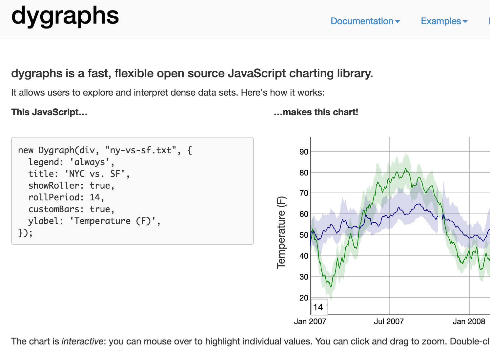
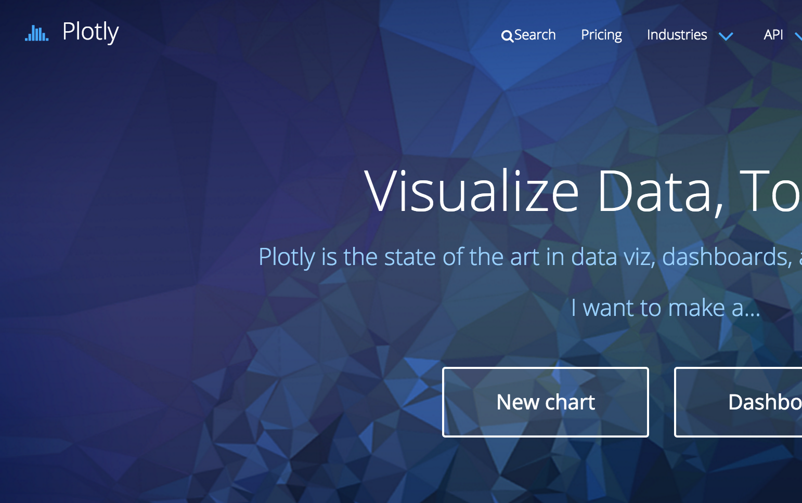

## Why? Presenting research results {.flexbox .vcenter}

<script src="http://ajax.googleapis.com/ajax/libs/jquery/1.9.1/jquery.min.js"></script>

```{r setup, include=FALSE}
knitr::opts_chunk$set(echo = FALSE)
# source("packages.R")
```


```{r, out.width = 600, fig.retina = NULL}
knitr::include_graphics("img/nature.png")
```

Nature, October 2014


## Why? Teaching {.columns-2}

Least squares estimation

Linear regression model

$$
y_i = \alpha + \beta x_i + \epsilon
$$

Estimates for the intercept and slope can be found by minimizing the squared residuals.

$$
\arg\min_{\alpha, \beta} \sum_i \left(y_i - (\alpha + \beta x_i) \right)^2
$$

<br><br><br><br>


```{r, out.width = 400, fig.retina = NULL}
knitr::include_graphics("img/fedtsyre.png")
```


## Why? Teaching {.centered}

```{r, out.width = 500, fig.retina = NULL}
knitr::include_graphics("img/fedtsyre.png")
```

## Why? Teaching {.centered}

```{r, out.width = 500, fig.retina = NULL}
knitr::include_graphics("img/fedtsyrer1.png")
```

## Why? Teaching {.centered}

```{r, out.width = 500, fig.retina = NULL}
knitr::include_graphics("img/fedtsyrer2.png")
```

## Why? Teaching

Slidify

```{r eval=FALSE, echo=TRUE}
library(shiny)
runGitHub('ekstroem/ShinyLeastSquares')
```


The "role" of graphics is changing and expanding


## Background { .columns-2 .center .smaller }

### **Toby**

```{r, out.width = 150, fig.retina = NULL}

```

 - Dept. Human Genetics, McGill University.
 - R packages: `directlabels`, `animint`, `plotly`, ...
 - Animint book in progress https://github.com/tdhock/animint-book
 - Uses interactive graphics for machine learning model visualization.

<br><br><br>

### **Claus**

```{r, out.height = 150, fig.retina = NULL}
knitr::include_graphics("img/ekstrom-2014.jpg")
```

 - Dept. Biostatistics, UCPH
 - R packages: ` MESS `, ` MethComp `, ` SuperRanker `, ...
 - R book: The R Primer
 - Happy/**frustrated** interactive graphics enthusiast


## Outline for the tutorial { .smaller .columns-2 }

|Topic |
|------|
| Introduction  (**10 min.**)
| Interactive graphics/javascript (htmlwidgets, **30 min**) |
| Interactive graphics (ggplotly/ggiraph) **20 minutes** |
| Shiny  **20 minutes** |
| Intro to animation and direct manipulation **5 minutes** |
| Basics of ggplot2 and animint  **25 minutes** |
| aes(showSelected), animation  **25 minutes** |
| aes(clickSelects), direct manipulation   **25 minutes** |


<br><br><br>


**Tutorial goals:**

1. Explain and emphasize the role that interactive graphics have in reporting, scientific journals, and in teaching.
2. Give overview of existing R packages for interactive graphics.
3. Explain the strengths and weaknesses of the existing R packages, to highlight directions for future work.

<br><br><br>


## Necessary stuff

Necesary packages etc XXX To be filled out at the end

Rstudio

See also: Toby's link

devtools::install_github("ramnathv/rCharts")


## The role of the graphics/viewer

<div class="centered">
```{r, out.height = 250, fig.retina = NULL}
knitr::include_graphics("img/napoleon.jpg")
```
</div>
<div class="columns-2">
```{r out.height=200, out.width = 500}
library(DiagrammeR)
grViz("
  digraph neato {

    rankdir=LR;
    node[width=.5,height=.5,fixedsize=false];
    { rank=same; A ; B}

    node [shape = circle]
    A -> {B}
    B -> {C}

    A[label='Data',shape=circle,fillcolor='lightblue',style='filled', fontsize=10];
    B[label='Researcher',shape=circle,fillcolor='lightblue',style='filled', fontsize=10];
    C[label='Viewer',shape=circle,fillcolor='lightblue',style='filled', fontsize=10];

  }")
```
```{r out.height=200, out.width = 500}
library(DiagrammeR)
grViz("
  digraph neato {

    rankdir=LR;
    node[width=.5,height=.5,fixedsize=FALSE];
    { rank=same; A ; B}

    node [shape = circle]
    A -> {B C}
    B -> {C}
    B -> {C}
    B -> {C}

    C -> {A}
    A[label='Data',shape=circle,fillcolor='lightblue',style='filled', fontsize=10];
    B[label='Researcher',shape=circle,fillcolor='lightblue',style='filled', fontsize=10];
    C[label='Viewer',shape=circle,fillcolor='lightblue',style='filled', fontsize=10];


  }")
```
</div>


## Interactive graphics architechture { .center }

<div class="centered">
```{r out.width = 650}
grViz("
  digraph neato {

    rankdir=LR;
    node[width=1,height=1,fixedsize=true];

    edge[weight=20];
    A -> B ;
    B -> A ;

    edge[weight=1];

    A -> { A }

    A[label='Client/\nuser',shape=circle,fillcolor='lightblue',style='filled'];
    B[label='Server',shape=circle,fillcolor='lightblue',style='filled'];
  }")
```
</div>
- Distribution and viewing
- Dedicated server vs. local server


# Javascript-based libraries (htmlwidgets)

## R and Javascript architecture { .columns-2 }

<div class="centered">
```{r, out.height = 100, fig.retina = NULL}
knitr::include_graphics("img/Logo_D3.png")
```
</div>

[D3.js](https://d3js.org/) doesn’t ship with any pre-built charts out of the box. However, go to website to get an overview of the possibilities.

- ChartJS
- Chartist.js
- [n3]
- [plotly](https://plot.ly/)


<div class="centered">
```{r, out.height = 400, fig.retina = NULL}
knitr::include_graphics("img/RJavaHtml.png")
```
</div>


## Highlevel interactive graphics { .columns-2 .smaller }

 Numerous possibilities in R packages

 - [**rCharts**](https://github.com/ramnathv/rCharts)  (oldish - mix of libraries)
 - [**highcharter**](http://jkunst.com/highcharter/) (standard plot types, mature library, maps, time series)
 - [**dygraphs**](https://rstudio.github.io/dygraphs/) (mostly time series. well documented. Rich features)
 - [**metricsgraphics**](https://github.com/hrbrmstr/metricsgraphics) (also time series)
 - [**leaflet**](https://rstudio.github.io/leaflet/) (maps)
 - [**htmlwidgets**](http://www.htmlwidgets.org/) Javascript framework (many are part of this). Super important!

 - [**plotly**](https://plot.ly/ggplot2/user-guide/) (general plots - like ggplot)
 - [**ggiraph**](https://github.com/davidgohel/ggiraph) (ggplot graphics interactive)

 <br><br>

<div class="centered">
```{r, out.height = 200, fig.retina = NULL}
knitr::include_graphics("img/frustration20logo.jpg")
```
</div>

- No standard interface
- Not easily extendable from R
- Pick a library and learn it!

## rCharts interfaces 

| library  | R function | Functionality           |
|:---------|-----|------------|
|[polychart](http://www.polychart.com/js/) | rPlot    | ggplot2-like |
|[Morris](http://morrisjs.github.io/morris.js/)    | mPlot    | Pretty time series |
|[nvd3](http://nvd3.org)      | nPlot    | Lines/areas/bars |
|[xCharts](http://tenxer.github.io/xcharts/)   | xPlot    | Various graphs |
|[Highcharts](http://www.highcharts.com/)| hPlot    | Interactive charts |
|[Leaflet](http://leafletjs.com/)   |  new()   | Interactive Maps |
|[Rickshaw](http://code.shutterstock.com/rickshaw/)  |  new()   | Real-time ts graphs |
|[Dimple](http://www.dimplejs.org)    | dPlot    | Business analytics |


## polychart (from rCharts package) { .columns-2 .smaller  }

`plot`/`lattice`-like function.

```{r warning=FALSE, echo=TRUE, message=FALSE, eval=FALSE}
library(rCharts)
library(MESS)
data(happiness)
mydf <- happiness
mydf$size <- sqrt(mydf$population)/8
r1 <- rPlot(x = "tax",
            y = "happy",
            data = mydf,
            type = "point",
            color = "continent",
            size = "size")
r1
```

Type: point, bar, line, ...

Add layers: `r1$layer(y= ..., copy_layer=TRUE, type="line")`  


```{r warning=FALSE, results='asis', message=FALSE, echo=FALSE}
library(dplyr)
library(viridis)
library(rCharts)
library(MESS)
library(xts)
data(happiness)
mydata <- happiness
mydata$size <- sqrt(mydata$population)/8
r1 <- rPlot(x = "tax", y = "happy", data = mydata, type = "point",
            color = "continent", size = "size")
r1$addParams(width = 400, height = 500)
#h1 <- hPlot(x = "tax", y = "happy", data = mydata, type = "bubble",
#            group = "continent", size = "size")
r1$show('inline', include_assets = TRUE)
#r1
```


## polychart (from rCharts package) { .columns-2 .smaller }

`plot`/`lattice`-like function. Add layers and guides to plot ..

```{r warning=FALSE, echo=TRUE, message=FALSE, eval=FALSE}
mydf2 <- data.frame(tax=c(1, 50),
                happy=c(4.93, 7.09))

r1$layer(x = "tax",
         y = "happy",
         data = mydf2,
         type = "line",
         size=list(const=4))

r1$guides(y = list(title="New label",
                   min=0, max=12))

r1
```

- `layer`  $\approx$ points/lines
- `guides` $\approx$ axis
- `addParams` $\approx$ title, plot size


```{r warning=FALSE, results='asis', message=FALSE, echo=FALSE}
mydf2 <- data.frame(tax=c(1, 50), happy=c(4.93976, 7.09233))

r2 <- rPlot(x = "tax", y = "happy", data = mydata, type = "point",
            color = "continent", size = "size")
r2$addParams(width = 400, height = 500)

r2$layer(x = "tax",
         y = "happy",
         data = mydf2,
         type = "line",
         size=list(const=4))

r2$guides(y = list(title = "New label",
                   min=0, max = 12))

r2$show('inline', include_assets = TRUE)

```


## polychart - tooltips { .columns-2 .smaller }

```{r warning=FALSE, message=FALSE, echo=TRUE, eval=FALSE}

r3 <- rPlot(x = "tax", y = "happy",
      data = mydf, type = "point",
      color = "continent",
      size = "size",
      tooltip="#!function(item){
return ('Country: ' +item.country+
        '&#013; Tax: ' +item.tax+
        '% Happiness: ' +item.happy+
        '<br> Pop: ' +item.population+
        ' mio.') }!#")

```

Passing javascript is non-trivial.

```{r results = 'asis', commment = NA, message = FALSE, echo = FALSE, warning=FALSE}
mydf <- happiness
mydf$size <- sqrt(mydf$population)/8

r3 <- rPlot(x = "tax", y = "happy",
      data = mydf, type = "point",
      color = "continent",
      size = "size",
      tooltip="#!function(item){
return ('Country: ' +item.country+
        '&#013; Tax: ' +item.tax+
        '% Happiness: ' +item.happy+
        '<br> Pop: ' +item.population+
        ' mio.') }!#")

r3$addParams(width = 400, height = 500)


r3$show('inline', include_assets = TRUE)

```


## [Highcharts](http://www.highcharts.com)


## [highcharter]((http://jkunst.com/highcharter/index.html)) (highcharter package) {.columns-2 .smaller }

```{r}
knit_print.htmlwidget <- function(x, ..., options = NULL){
  options(pandoc.stack.size = "2048m")
  wdgtclass <- setdiff(class(x), "htmlwidget")[1]
  wdgtrndnm <- paste0(sample(letters, size = 7), collapse = "")
  wdgtfname <- sprintf("wdgt_%s_%s.html", wdgtclass, wdgtrndnm)
  htmlwidgets::saveWidget(x, file = wdgtfname, selfcontained = TRUE, background = "transparent")
  iframetxt <- sprintf("<iframe frameBorder=\"0\" src=\"%s\" width=\"100%%\" height=\"600\"></iframe>", wdgtfname)
  knitr::asis_output(iframetxt)
}

```

Mature charts, stocks (time series), maps. Good API.

- Start with empty chart and add components.
- (Mostly) no default arguments

```{r echo=TRUE,eval=FALSE}
library(highcharter)
hc <- highchart() %>%
  hc_chart(type = "column") %>%
  hc_title(text = "Denmark") %>%
  hc_xAxis(categories = 2011:2016) %>%
  hc_add_series(data = c(3806,  6184,
                         7557, 14792,
                         21315, 3016),
          name = "Asylum seekers") %>%
  hc_add_serie(name = "Syria",
               data = c(429, 822,
                      1710, 7087,
                       8608, 777),
               type = "spline")
hc
```

<br><br><br>

```{r echo=FALSE, eval=TRUE}
library(highcharter)
hc <- highchart() %>%
  hc_chart(type = "column") %>%
  hc_title(text = "Denmark") %>%
  hc_xAxis(categories = 2011:2016) %>%
  hc_add_series(data = c(3806,  6184,
                         7557, 14792,
                         21315, 3016),
          name = "Asylum seekers") %>%
  hc_add_series(name = "Syria",
               data = c(429, 822,
                      1710, 7087,
                       8608, 777),
               type = "spline")

hc
```

## highcharter - adding data { .smaller }

Data are added using one of the following functions

| Name |  Function |
|---+----------|
| hc_add_series | Add single series (named: `data`, `name`) |
| hc_add_series_list | Add *list* named series |
| hc_add_series_df | Add data.frame. Name variables accordingly |
| hc_add_series_ts | Add ts object. Extra argument: `name` |
| hc_add_series_scatter | Create scatter from two vectors. Extra arguments (size, color, label) |
| hc_add_series_boxplot | Add boxplots |
| hc_add_series_map | Add geojson map |

Chart types: line (default), column, boxplot, bubble, arearange, heatmap, funnel, pie, ...

Also: the `hchart` function (a la `plot`)


## Highcharter function overview { .smaller }

| Function | Example |
|---+-------------|
| Title, subtitle  | hc_title(text = "Temperature"), hc_subtitle(text = "Somewhere warm") |
| Axis   | hc_xAxis(categories = month) |
|        | hc_yAxis(title = list(text = "Temperature"), labels = list(format = "{value} C")) |
| Theme  | hc_add_theme(hc_theme_sandsignika()) |
| Zoom   | hc_chart(zoomType = "xy") |
| Export | hc_exporting(enabled = TRUE) |
| Tooltip | hc_tooltip(useHTML = TRUE, headerFormat="&lt;table&gt;", |
|         | pointFormat = "&lt;tr&gt;&lt;th&gt;x-val&lt;/th&gt;&lt;td&gt;{point.x}&lt;/td&gt;&lt;/tr&gt;" |
|         | footerFormat = "&lt;/table&gt;") |
| Legend  | hc_legend(enabled=FALSE) |
| Credits | hc_credits(enabled = TRUE, text = "Source: Wikipedia", href = "https://wikipedia.com", style = list(fontSize = "12px")) |


## Highcharter - adding information { .smaller }


```{r echo=TRUE, eval=FALSE}
happiness$size <- sqrt(happiness$population)/8
hap <- happiness # Shorten name
happy2 <- highchart() %>%
  hc_title(text = "Taxes and happiness") %>%
  hc_subtitle(text = "Source: Wikipedia") %>%
  hc_xAxis(title = list(text = "Taxation (%)")) %>%
  hc_yAxis(title = list(text = "Happiness")) %>%
  hc_chart(zoomType = "xy") %>% hc_exporting(enabled = TRUE) %>%
  hc_add_serie_scatter(hap$tax, hap$happy, 
                       hap$size, hap$continent, hap$country,
                       dataLabels = list( enabled = TRUE,
                                    format = "{point.label}")) %>%
  hc_tooltip(useHTML = TRUE,
             headerFormat = "<table>",
             pointFormat = paste("<tr><th colspan=\"1\"><b>{point.label}</b></th></tr>",
                                 "<tr><th>Tax</th><td>{point.x} %</td></tr>",
                                 "<tr><th>Score</th><td>{point.y}</td></tr>",
                                 "<tr><th>Pop</th><td>{point.z} </td></tr>",
                                 "<tr><th>Cont.</th><td>{point.valuecolor} hp</td></tr>",
                                 "<tr><th>Religion</th><td>{point.extrainfo} hp</td></tr>"),
             footerFormat = "</table>")
happy2
```


## Highcharter - adding information


```{r}
library(dplyr)
library(viridis)
happiness$size <- sqrt(happiness$population)/8
hap <- happiness # Shorten name

# Extra tooltip
colorvar <- hap$continent
cols <- viridis(1000)[round(ecdf(colorvar)(colorvar)*1000)]
cols <- substr(cols, 0, 7)
dt <- hap %>% mutate(x=tax, y=happy, z=size, color=cols, label=country)
ds <- list.parse3(dt)

happy2 <- highchart() %>%
  hc_title(text = "Taxes and happiness") %>%
  hc_subtitle(text = "Source: Wikipedia") %>%
  hc_xAxis(title = list(text = "Taxation (%)")) %>%
  hc_yAxis(title = list(text = "Happiness")) %>%
  hc_chart(zoomType = "xy") %>%
  hc_exporting(enabled = TRUE) %>%
  hc_add_series(data=ds, name=FALSE, type="bubble", showInLegend=FALSE,
                dataLabels = list(enabled = TRUE, format = "{point.label}")) %>%
  hc_tooltip(useHTML = TRUE,
             headerFormat = "<table>",
             pointFormat = paste("<tr><th colspan=\"1\"><b>{point.label}</b></th></tr>",
                                 "<tr><th>Tax</th><td>{point.x} %</td></tr>",
                                 "<tr><th>Score</th><td>{point.y}</td></tr>",
                                 "<tr><th>Pop</th><td>{point.z} </td></tr>",
                                 "<tr><th>Cont.</th><td>{point.continent} </td></tr>",
                                 "<tr><th>Religion</th><td>{point.religion}</td></tr>"),
             footerFormat = "</table>")
happy2
```

## Exercise 

Take the `airquality` dataset. Plot series of temperature and wind speed for June using for example `highcharter` or `polychart`.

```{r eval=FALSE, echo=TRUE}
data(airquality)
aq <- subset(airquality, Month==6)
head(aq)

library(highcharter)
hc <- highchart() %>%
  hc_chart(type = "column") %>%
  hc_title(text = "Denmark") %>%
  hc_xAxis(categories = aq$Day) %>% 
  hc_yAxis_multiples(
    list(title = list(text = "Temperature (F)")), 
    list(opposite=TRUE, title = list(text = "Speed (MPH)"))) %>%
 ...
```


## One solution

```{r}
library(highcharter)
data(airquality)
aq <- subset(airquality, Month==6)
hc <- highchart() %>%
  hc_chart(type = "column") %>%
  hc_title(text = "Denmark") %>%
  hc_xAxis(categories = 1:30) %>% 
hc_add_series(data = aq$Temp,
          name = "Temperature") %>%
  hc_add_series(name = "Wind speed",
               data = aq$Wind,
               type = "spline")

hc
```


## [dygraphs](http://dygraphs.com/index.html)




## dygraphs { .columns-2 .smaller }

Same build-up as highcharter. Most of the information passed in `dygraph` and `dyOptions`.

`xts` extended time series


```{r echo=TRUE, eval=FALSE}
library(dygraphs)
library(MESS)
library(xts)
data(greenland)
rownames(greenland) <-
  paste0(greenland$year, "-07-15")
greenland$year <- NULL
temp <- as.xts(greenland)
dygraph(temp, 
        main="Av. Summer temp") %>%
  dyRangeSelector(dateWindow = 
      c("1960-01-01", "2011-01-01"))
```

Series can be added with `dySeries`. 

<br><br><br>

```{r echo=FALSE, eval=TRUE}
library(dygraphs)
library(MESS)
library(xts)
data(greenland)
rownames(greenland) <-paste(greenland$year, 
                          "-07-15", sep="")
greenland$year <- NULL
temp <- as.xts(greenland)
dygraph(temp, 
        main="Average Summer temp") %>%
  dyRangeSelector(dateWindow = 
             c("1960-01-01", "2011-01-01"))
```


## dygraphs functions { .smaller }

| Function | Example |
|------+----------------|
| Title  | dygraph(data, main = "My Title")  |
| Axis   | dyAxis("x", drawGrid = TRUE, label="My X axis") |
| Zoom/panning | dyRangeSelector() |
| Highlights | dyHighlight(highlightSeriesOpts = list(strokeWidth = 3)) |

| dyOptions/dySeries | Example |
|----------+----------------|
| Step Plot | dyOptions(stepPlot = TRUE) |
| Colour    | dyOptions(colors="blue")  |
| Fill      | dyOptions(fillGraph = TRUE, fillAlpha = 0.4) |
| L/V/U     | A 3-vector name has special meaning (lower, value, upper). `dySeries(c("L", "V", "U"))`

Also: `dyShading`, `dyEvent`, ... 


## dygraphs 2 { .columns-2 .smaller }

Danish Monthly births/deaths. Multiple series.

```{r echo=TRUE, eval=FALSE}
library(MESS)
library(dygraphs)
data(bdstat)
births <- ts(bdstat$births[1:(12*112)], 
             frequency=12, 
             start=c(1901, 1)) 
deaths <- ts(bdstat$dead[1:(12*112)], 
             frequency=12, 
             start=c(1901, 1)) 
DKdata <- cbind(births, deaths)
dygraph(DKdata, 
        main="Births/Deaths") %>%
  dyAxis("x", drawGrid = FALSE) %>%
  dySeries("births", drawPoints=TRUE, 
           color = "blue") %>%
  dySeries("deaths", stepPlot = TRUE, 
           fillGraph = TRUE, 
           color = "red") %>%
  dyHighlight(highlightSeriesOpts = 
              list(strokeWidth = 3)) 
```

<br><br><br><br>


```{r echo=FALSE}
library(MESS)
library(dygraphs)
data(bdstat)
births <- ts(bdstat$births[1:(12*112)], frequency=12, start=c(1901, 1)) 
deaths <- ts(bdstat$dead[1:(12*112)], frequency=12, start=c(1901, 1)) 
DKdata <- cbind(births, deaths)
dkb <- HoltWinters(births)
predicted <- predict(dkb, n.ahead = 50*12, prediction.interval = TRUE)
dygraph(DKdata, main = "Births/Deaths (DK)") %>%
  dyAxis("x", drawGrid = FALSE) %>%
  dySeries("births", drawPoints = TRUE, color = "blue") %>%
  dySeries("deaths", stepPlot = TRUE, fillGraph = TRUE, color = "red") %>%
  dyHighlight(highlightSeriesOpts = list(strokeWidth = 3)) 
```


## dygraphs 3 { .columns-2 .smaller }

Danish Monthly births/deaths. Multiple series. Prediciton

```{r echo=TRUE,eval=FALSE}
dkb <- HoltWinters(births)
p <- predict(dkb, n.ahead = 50*12, 
             prediction.interval=TRUE)
all <- cbind(births, p)
dygraph(all, main = "Births (DK)") %>%
  dySeries("births", drawPoints = TRUE, 
           color = "blue", 
           label="asd") %>%
  dySeries(c("p.lwr","p.fit","p.upr"),
           color = "red")
```

<br><br><br><br><br><br>

```{r echo=FALSE, eval=TRUE}
dkb <- HoltWinters(births)
p <- predict(dkb, n.ahead = 50*12, 
             prediction.interval = TRUE)
all <- cbind(births, p)
dygraph(all, main = "Births (DK)") %>%
  dySeries("births", drawPoints = TRUE, 
           color = "blue", label="asd") %>%
  dySeries(c("p.lwr", "p.fit", "p.upr"),
           color = "red")
```


## [leaflet](http://leafletjs.com/)


## The [leaflet](https://rstudio.github.io/leaflet/) package

Beautiful maps crated by adding layers on top of maps.

```{r}
library(leaflet)

m <- leaflet() %>%
  addTiles() %>%  # Default OpenStreetMap map tiles
  addMarkers(lat=37.431106, lng=-122.164672, popup="useR 2016") 
m 
```

## **leaflet example**

```{r echo=TRUE, eval=FALSE}
library(leaflet)

m <- leaflet() %>%
  addTiles() %>%  # Default OpenStreetMap map tiles
  addMarkers(lat=37.431106, lng=-122.164672, popup="useR 2016") 
m 
```


## **leaflet function overview**

Main functions

| Function | Example |
|--------+----------|
| Default map  |  addTiles()  |
| Alternative maps | addProviderTiles("CartoDB.DarkMatter", options = providerTileOptions(opacity = 0.35))    Stackable! |
| Markers | addMarkers(~long, ~lat, popup = ~as.character(mag)) |
| Pop-ups | addPopups(lng=-122.164672, lat=37.431106, "&lt;a href='http://www.user2016.org'&gt; Hi &lt;/a&gt;",  options = popupOptions(closeButton = FALSE)) |
| Custom icons | makeIcon() |


## **Earthquakes**

```{r eval=FALSE, echo=TRUE, message=FALSE}
library(leaflet)
library(MESS)

pal <- colorNumeric("RdYlBu", 
                    domain = NULL)
data(earthquakes)
m <- leaflet(subset(earthquakes,  mag>3)) %>%
  addProviderTiles("CartoDB.DarkMatter") %>%  
addCircleMarkers(
    radius = ~ mag*3,
    color  = ~ pal(depth),
    stroke = FALSE, fillOpacity = 0.4
  )
m
```

## **Earthquakes**

```{r eval=TRUE, echo=FALSE, message=FALSE}
library(leaflet)
library(MESS)

pal <- colorNumeric("RdYlBu", 
                    domain = NULL)
data(earthquakes)
m <- leaflet(subset(earthquakes,  mag>3)) %>%
  addProviderTiles("CartoDB.DarkMatter") %>%  # Add default OpenStreetMap map tiles
addCircleMarkers(
    radius = ~ mag*4,
    color  = ~ pal(depth),
    stroke = FALSE, fillOpacity = 0.5
  )
m
```


## **Exercise** 

Create your own icon and pop-up on this map.

```{r eval=FALSE, echo=TRUE}
library(leaflet)
m <- leaflet() %>%
  addTiles() %>%  # Default OpenStreetMap map tiles
  addMarkers(lng=-122.164672, lat=37.431106, popup="useR 2016") 
m 
```

Add the R icon to the map: https://www.r-project.org/logo/Rlogo.png

(Use `icon` instead of `popup` in  `addMarkers`)

Create simple icon:

```{r echo=TRUE}
greenLeafIcon <- makeIcon(
  iconUrl = "http://leafletjs.com/docs/images/leaf-green.png",
  iconWidth = 38, iconHeight = 95,
  iconAnchorX = 22, iconAnchorY = 94
)
```


## **Publishing interactive graphics**

Note: html/js output. Need javascript machinery to run (ie., html with js code embedded or online link).

```{r eval=FALSE, echo=TRUE}
library(htmlwidgets)
saveWidget(widget, file, selfcontained = TRUE, background="white")
```

### Including in R markdown

`htmlwidget` widgets behave nicely in R markdown.

### Otherwise

`as.iframe` to appear.


# Javascript-based libraries (ggplotly and ggiraph)


## ggplotly and ggiraph

Use ggplot2 (and grammar of graphics) to render interactive graphics.

- ggplotly use the [plot.ly]() service
- ggiraph uses it's own htmlwidget extensions.


## [Plotly](https://plot.ly/) - ggplotly




## The [plotly](https://plot.ly/ggplot2/) package

Use legend to toggle traces, zoom, shift and click to pan.
Super simple: `p <- ggplot() ; ggplotly(p)`

```{r message=FALSE}
library(plotly)

x <- rnorm(100)
y <-  + .7*x + rnorm(100)
f1 <- as.factor(c(rep("A",50),rep("B",50)))
f2 <- as.factor(rep(c(rep("C",25),rep("D",25)),2))
df <- data.frame(cbind(x,y))
df$f1 <- f1
df$f2 <- f2

g <- ggplot(df,aes(x=x,y=y)) +
    geom_point() +
    facet_grid(f1~f2) +
    stat_smooth(method="lm")

ggplotly(g)
```


## Revisiting the happiness data
```{r warning=FALSE, message=FALSE, echo=TRUE, eval=FALSE}
library(ggplot2)
library(plotly)

p <- ggplot(happiness, 
            aes(x=tax, y=happy, color=continent, size=population, 
                text = paste("country:", country))) + 
  geom_point( alpha = I(0.8)) + 
  scale_size_area(max_size = 30) + 
  geom_smooth(method="lm", se= F, size = 1, 
              aes(linetype = continent, group = continent))
ggplotly(p)
```

## Revisiting the happiness data
```{r warning=FALSE, message=FALSE}
p <- ggplot(happiness, aes(x=tax, y=happy, color=continent, size=population, text = paste("country:", country))) + geom_point( alpha = I(0.8)) + scale_size_area(max_size = 30) + geom_smooth(method="lm", se= F, size = 1, aes(linetype = continent, group = continent))
ggplotly(p)
```


## Publishing ggplotly graphics


### Works directly in R markdown / knitr

Just works (automatically embedded)

### Post on plot.ly account 

Embed the graph as an iframe

```{r eval=FALSE, echo=TRUE}
signup("username", "email", save=TRUE)
plotly_POST(p, "My Chart")
```


## The [ggiraph](https://github.com/davidgohel/ggiraph) package

Extends `ggplot2` with new `geom` functions.

- `geom_point_interactive`, `geom_polygon_interactive`, `geom_map_interactive`, `geom_path_interactive`, `geom_rect_interactive`, `geom_segment_interactive`, `geom_text_interactive`

Three arguments let you add interactivity:

- `tooltip`: mouse-over tooltips to be displayed when mouse is over elements.
- `onclick`: javascript function to be executed when elements are clicked.
- `data_id`: id to be associated with elements.


## ggiraph example - happiness

```{r echo=TRUE, eval=FALSE}
library(ggiraph)

happiness$tooltip <- paste0("<table><th>Welcome to</th><tr><td>", 
                            happiness$country, 
                            "</td></tr></table>")

p <- ggplot(happiness, 
            aes(x=tax, y=happy, color=continent, 
                size=population, tooltip=tooltip)) + 
  geom_point_interactive(alpha=I(.8)) + 
  scale_size_area(max_size = 30)

ggiraph(code = {print(p)}, height = "350px")
```

## ggiraph example - happiness

```{r warning=FALSE, message=FALSE}
library(ggiraph)

happiness$tooltip <- paste0("<table><th>Welcome to</th><tr><td>", 
                            happiness$country, 
                            "</td></tr></table>")

p <- ggplot(happiness, 
            aes(x=tax, y=happy, color=continent, 
                size=population, tooltip=tooltip)) + 
  geom_point_interactive(alpha=I(.8)) + 
  scale_size_area(max_size = 30)

ggiraph(code = {print(p)}, width="600px", height = "300px")

```


## ggiraph and dataid and onclick events { .smaller }

```{r echo=TRUE, eval=FALSE}
library(ggiraph)

happiness$tooltip <- paste0("<table><th>Welcome to</th><tr><td>", happiness$country, "</td></tr></table>")

happiness$onclick <- sprintf(
  "window.open(\"%s%s\")",
  "http://en.wikipedia.org/wiki/",
  as.character(happiness$country)
)

happiness$data_id <- happiness$country

p3 <- ggplot(happiness, 
            aes(x=tax, y=happy, color=continent, 
                size=population, tooltip=tooltip, onclick=onclick)) + 
  geom_point_interactive(alpha=I(.8)) + 
  scale_size_area(max_size = 30)

ggiraph(code = print(p3), 
        width="600px", height = "300px"
)
```


## ggiraph and dataid and onclick events

```{r message=FALSE, warning=FALSE}
library(ggiraph)

happiness$tooltip <- paste0("<table><th>Welcome to</th><tr><td>", happiness$country, "</td></tr></table>")

happiness$onclick <- sprintf(
  "window.open(\"%s%s\")",
  "http://en.wikipedia.org/wiki/",
  as.character(happiness$country)
)

happiness$data_id <- happiness$country


p2 <- ggplot(happiness, 
            aes(x=tax, y=happy, color=continent, 
                size=population, tooltip=tooltip, onclick=onclick, data_id=data_id)) + 
  geom_point_interactive(alpha=I(.8)) + 
  scale_size_area(max_size = 30)

ggiraph(code = print(p2), 
        hover_css = "fill-opacity:.3;cursor:pointer;",
           width="600px", height = "300px")
```


## Exercise { .smaller }

Use ggplotly/ggiraph to create an interactive plot of development in average Danish life expectancy for males and females.


```{r echo=TRUE}
library(MESS)
data(lifeexpect)
head(lifeexpect)
```

Could start with 

```{r}
library(ggiraph)
p <- ggplot(lifeexpect, aes(x=myear, y=male)) + geom_path()
p
```


# Shiny

## Shiny { .smaller }

Use standard R. Rather simple and beautiful. Requires server, or running locally in R.

Two files
```
  Directory
  |
  +-- ui.R
  +-- server.R
```

Or single file, `app.R`, with 
```{r, eval=FALSE, echo=TRUE}
server <- function(input, output) { ... }
ui <- fluidPage( ...)

shinyApp(ui = ui, server = server)
```


Run using 
```{r echo=TRUE, eval=FALSE}
library(shiny)
runApp("/path/to/directory")           # Local
runGitHub('ekstroem/ShinySampleMean')  # From GitHub
```


## Example

```{r eval=FALSE,echo=TRUE}
library(shiny)
runGitHub('ekstroem/ShinySampleMean')
```

## Shiny User Interface

"Standard" [design layout](http://shiny.rstudio.com/articles/layout-guide.html) with sidebar for input and main window for output.

```{r eval=FALSE, echo=TRUE}
library(shiny)

shinyUI(pageWithSidebar(
  
  titlePanel("My title"), # Application title

  sidebarLayout(          # Layout for this page
    sidebarPanel(         # Well a side bar panel
      selectInput()       # Input type
    ),  
    mainPanel(
      plotOutput()        # Types of output
    )                     # ... and main panel
  )
))
```

## Shiny server interface

Communication through `input`  and `output` lists.

```{r eval=FALSE, echo=TRUE}
library(shiny)

# Define server 
shinyServer(function(input, output) {
  
  output$something <- renderFunction( 
    v1 <- input$variable1 # Get input
    ... 
    )
})
```

## User interface functions { .columns-2 .smaller  }

### Inputs 

- `checkboxInput`	- Check box
- `dateInput`	- Calendar to aid date selection
- `dateRangeInput`	- Pair of calendars for selecting a date range
- `fileInput`	- File upload control wizard
- `numericInput`	- Field to enter numbers
- `radioButtons`	- Set of radio buttons
- `selectInput`	- Box with choices to select from
- `sliderInput`	- Slider bar
- `textInput` - Text area

### Outputs

- `htmlOutput`	- raw HTML
- `imageOutput`	- image
- `plotOutput`	- plot
- `tableOutput`	- table
- `textOutput`	- text
- `verbatimTextOutput`	- text

## Server side functions { .smaller  }

Input functions are strings

* `renderImage` - images (saved as a link to a source file)
* `renderPlot` - plots
* `renderPrint` - any printed output
* `renderTable` - data frame, matrix, other table like structures
* `renderText` - Raw text

Each `render*` function takes a single argument: an R expression surrounded by braces, {}.

## Example { .smaller }

```{r eval=FALSE, echo=TRUE}
library(shiny)

ui <- fluidPage(
  titlePanel("My title"),
  sidebarLayout(
	  sidebarPanel(
      selectInput("xvar", label = h3("Select x"),
                  choices = list("A"=1, "B"=2, "C"=3),
			selected = 1)),
    mainPanel(
      textOutput("text"),
      plotOutput("plot", height="600")
    )))

server <- function(input, output) {
    output$plot <- renderPlot({
        mytext <- input$xvar
        hist(rnorm(1000), col="lightred")
    })
    output$text <- renderText( { paste0("Hello ", mytext) } )
}

shinyApp(ui = ui, server = server)
```
	  

## Example - view data frame

```{r eval=FALSE, echo=TRUE}
runGitHub("ekstroem/useRapp")
```

## Exercise

Try to run the code from previous example. Add a slider to change the point size in the graph.

1. Look at the code
2. Add `sliderInput` (arguments: label, text, start value, min value, max value)
3. Change server function to accommodate the new input