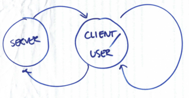

output: slidy_presentation

## Why - presenting research results {.flexbox .vcenter}

<script src="http://ajax.googleapis.com/ajax/libs/jquery/1.9.1/jquery.min.js"></script>

```{r setup, include=FALSE}
knitr::opts_chunk$set(echo = FALSE)
```


Nature, October 2014


## Why - teaching


Least squares estimation

Linear regression model

$$
y_i = \alpha + \beta x_i + \epsilon
$$

Estimates for the intercept and slope can be found by minimizing the squared residuals.

$$
\arg_{\alpha, \beta} \min \sum_i \left(y_i - (\alpha + \beta x_i) \right)^2
$$


</div>


## Why - teaching


## Why - teaching


## Why - teaching


## Why - teaching

Slidify

```{r eval=FALSE,echo=TRUE}
library(shiny)
runGitHub('ekstroem/ShinyLeastSquares')
```


## Background

<div class="columns-2">
  
  
  Toby: asasdasd

Claus: asdasd

 - Dept. Biostatistics, UCPH
 - 
 -
  
</div>
(Some stuff about us)


## Outline for the tutorial

 - Introduction [**15 minutes**]. Concepts. Quick quiz
 - Highlevel interactive graphics [**35 minutes**]. Javascript. Exercises
 - Interactive graphics [**35 minutes**]. Shiny. Exercises
 - Break
 - Multi layer/-panel graphics [**30 minutes**]
 - Animated graphics [**30 minutes**]
 - Putting it all together [**30 minutes**]


Tutorial goals:

## Necessary stuff

Necesary packages etc 

Rstudio

See also: Toby's link

devtools::install_github("ramnathv/rCharts")


## Concepts

Tobys slides terms / discussion


 - multi-layer, multi-panel, multi-plot
 - animation, direct manipulation (clicking, hovering), indirect manipulation (buttons, menus)
 - zoom, highlight, show/hide (data, labels, tooltips)

## The role of the viewer

Thinking about graphics


## Quiz

Or something else. Quick example quiz


## Interactive graphics architechture



Dedicated server vs. local server 


## d3.js

JavaScript libraries, D3.js doesn’t ship with any pre-built charts out of the box. However, you can look at the list of graphs built with D3.js to get an overview.

- ChartJS
- Chartist.js
- n3
- plotly


### R and Javascript architecture

R -> package -> javascript library  -> html/javascript

View in browser. More problematic to share


## Highlevel interactive graphics

 Numerous possibilities in R
 
 - rCharts
 - highcharter
 - dygraph
 - plotly
 - **htmlwidgets**
 
 
  R markdown
    + Markdown + embedded R code chunks like knitr
    +  .Rmd -> .md -> .html (docx, pdf)
    + RStudio: "Knit" command (Ctrl+Shift+K)


## rCharts interfaces

| library  | function |            |
|:---------|----------|------------|
|[polychart](http://www.polychart.com/js/) | rPlot    | ggplot2-like |
|[Morris](http://morrisjs.github.io/morris.js/)    | mPlot    | Pretty time series |
|[nvd3](http://nvd3.org)      | nPlot    | Lines/areas/bars |
|[xCharts](http://tenxer.github.io/xcharts/)   | xPlot    | Various graphs |
|[Highcharts](http://www.highcharts.com/)| hPlot    | Interactive charts |
|[Leaflet](http://leafletjs.com/)   |  new()   | Interactive Maps |
|[Rickshaw](http://code.shutterstock.com/rickshaw/)  |  new()   | Real-time ts graphs |
|[Dimple](http://www.dimplejs.org)    | dPlot    | Business analytics |
|[metricsgraphics](http://metricsgraphicsjs.org/)    | mjs_plot    | Time-series |
|[dygraphs](http://dygraphs.com/)    | dygraph    | Time-series |


## polychart

R-like 

```{r warning=FALSE, results='asis'}
library(rCharts)
library(MESS)
data(happiness)
mydata <- happiness
mydata$size <- sqrt(mydata$population)/8
r1 <- rPlot(x = "tax", y = "happy", data = mydata, type = "point", 
            color = "continent", size = "size")
#h1 <- hPlot(x = "tax", y = "happy", data = mydata, type = "bubble", 
#            group = "continent", size = "size")
r1$show('inline', include_assets = TRUE)
#r1
```

## Highcharts - highcharter


## highcharter

```{r}
knit_print.htmlwidget <- function(x, ..., options = NULL){ 
  options(pandoc.stack.size = "2048m") 
  wdgtclass <- setdiff(class(x), "htmlwidget")[1] 
  wdgtrndnm <- paste0(sample(letters, size = 7), collapse = "") 
  wdgtfname <- sprintf("wdgt_%s_%s.html", wdgtclass, wdgtrndnm) 
  htmlwidgets::saveWidget(x, file = wdgtfname, selfcontained = TRUE, background = "transparent") 
  iframetxt <- sprintf("<iframe frameBorder=\"0\" src=\"%s\" width=\"100%%\" height=\"600\"></iframe>", wdgtfname)  
  knitr::asis_output(iframetxt) 
} 

# knit_print.htmlwidget(hc)
```

<div class="columns-2">
```{r echo=TRUE}
library(highcharter)
hc <- highchart() %>% 
  hc_chart(type = "column") %>% 
  hc_title(text = "A highcharter chart") %>% 
  hc_xAxis(categories = 2012:2016) %>% 
  hc_add_series(data = c(3900,  4200,  5700,  8500, 11900),
                name = "Downloads")
hc
```
</div>

Build graph from bottom up.

## Highcharter - adding data

hc_add_series / hc_add_series_list
hc_add_series_df
add_serie_scatter


## Highcharter - scatter points and lines

```{r}
citytemp <- data.frame(month=month.name, london=1:12, new_york=2:13) 
hc <- highchart() %>% 
  hc_title(text = "Temperatures for some cities") %>% 
  hc_xAxis(categories = citytemp$month) %>% 
  hc_add_serie(name = "London", data = citytemp$london, type="column", 
               dataLabels = list(enabled = TRUE)) %>%
  hc_add_serie(name = "New York", data = citytemp$new_york,
               type = "spline") %>% 
  hc_yAxis(title = list(text = "Temperature"),
           labels = list(format = "{value}? C")) %>%
  hc_add_theme(hc_theme_sandsignika())

hc
```

## Highcharter function overview

Function, types


## Highcharter - adding information


```{r}
hcmtcars <- highchart() %>% 
  hc_title(text = "Motor Trend Car Road Tests") %>% 
  hc_subtitle(text = "Source: 1974 Motor Trend US magazine") %>% 
  hc_xAxis(title = list(text = "Weight")) %>% 
  hc_yAxis(title = list(text = "Miles/gallon")) %>% 
  hc_chart(zoomType = "xy") %>% 
  hc_add_serie_scatter(mtcars$wt, mtcars$mpg,
                       mtcars$drat, mtcars$hp,
                       rownames(mtcars),
                       dataLabels = list(
                         enabled = TRUE,
                         format = "{point.label}"
                       )) %>% 
  hc_tooltip(useHTML = TRUE,
             headerFormat = "<table>",
             pointFormat = paste("<tr><th colspan=\"1\"><b>{point.label}</b></th></tr>",
                                 "<tr><th>Weight</th><td>{point.x} lb/1000</td></tr>",
                                 "<tr><th>MPG</th><td>{point.y} mpg</td></tr>",
                                 "<tr><th>Drat</th><td>{point.z} </td></tr>",
                                 "<tr><th>HP</th><td>{point.valuecolor} hp</td></tr>"),
             footerFormat = "</table>")
hcmtcars
```


## Highcharter - Happyness and taxes

(replace the one above)

```{r results="asis", message=FALSE, warning=FALSE}
library(MESS)
data(happiness)
mydata <- happiness
mydata$size <- sqrt(mydata$population)/8
h1 <- hPlot(x = "tax", y = "happy", data = mydata, type = "bubble", 
            group = "continent", size = "size")
#h1$show('iframesrc', cdn = TRUE)
# h1$show('inline')
h1$show('inline', include_assets = TRUE)
#h1$print('chart1', include_assets = TRUE, cdn = TRUE)
```

## Highcharter function overview

References

## dygraph

```{r echo=TRUE}
library(dygraphs)
dygraph(nhtemp, main = "New Haven Temperatures") %>% 
  dyRangeSelector(dateWindow = c("1920-01-01", "1960-01-01"))
```


## dygraphs 2

```{r}
hw <- HoltWinters(ldeaths)
predicted <- predict(hw, n.ahead = 72, prediction.interval = TRUE)

dygraph(predicted, main = "Predicted Lung Deaths (UK)") %>%
  dyAxis("x", drawGrid = FALSE) %>%
  dySeries(c("lwr", "fit", "upr"), label = "Deaths") %>%
  dyOptions(colors = RColorBrewer::brewer.pal(3, "Set1"))
```  

## metricsgraphics

```{r}
library(htmlwidgets)
library(metricsgraphics)
library(RColorBrewer)
mtcars %>%
  mjs_plot(x=wt, y=mpg, width=600, height=500) %>%
  mjs_point(color_accessor=cyl,
            x_rug=TRUE, y_rug=TRUE,
            size_accessor=carb,
            size_range=c(5, 10),
            color_type="category",
            color_range=brewer.pal(n=11, name="RdBu")[c(1, 5, 11)]) %>%
  mjs_labs(x="Weight of Car", y="Miles per Gallon") %>%
  mjs_add_legend(legend="X")
```

Should be the same as before (happyness)

## Metricgraphics

```{r eval=FALSE, echo=TRUE}
library(RColorBrewer)

tmp <- data.frame(year=seq(1790, 1970, 10), uspop=as.numeric(uspop))

tmp %>%
  mjs_plot(x=year, y=uspop) %>%
  mjs_point() %>%
  mjs_add_marker(1850, "Something Wonderful") %>%
  mjs_add_baseline(150, "Something Awful")
```

## Metricgraphics

```{r}
library(RColorBrewer)

tmp <- data.frame(year=seq(1790, 1970, 10), uspop=as.numeric(uspop))

tmp %>%
  mjs_plot(x=year, y=uspop) %>%
  mjs_point() %>%
  mjs_add_marker(1850, "Something Wonderful") %>%
  mjs_add_baseline(150, "Something Awful")
```

## Metricgraphics function overview


## leaflet

```{r eval=FALSE, echo=TRUE}
library(leaflet)
library(MESS)


data(earthquakes)
m <- leaflet() %>%
  addTiles() %>%  # Add default OpenStreetMap map tiles
  addMarkers(lng=earthquakes$longitude[earthquakes$mag>6],          lat=earthquakes$latitude[earthquakes$mag>6], popup="Mag 6+")
m
```

## leaflet

```{r}
library(leaflet)
library(MESS)


data(earthquakes)
m <- leaflet() %>%
  addTiles() %>%  # Add default OpenStreetMap map tiles
  addMarkers(lng=earthquakes$longitude[earthquakes$mag>6],          lat=earthquakes$latitude[earthquakes$mag>6], popup="Mag 6+")
m
```

## leaflet function overview 


## rMaps  - choropleths

```{r results="asis", message=FALSE, warning=FALSE}
library(rMaps)
i1 <- ichoropleth(Crime ~ State, data = violent_crime, animate = "Year")
i1$show('inline', include_assets = TRUE)
```


## Publishing interactive graphics

html output. Need javascript machinery to run. 

```{r eval=FALSE, echo=TRUE}
saveWidget()
```

self_contained: false

html

standalone

javascript

images


## Including in R markdown


savewidget
iframe


## Exercise


# Shiny and plotly


## plotly + ggplotly

Differences to other libraries ... public


## ggplotly - ggplot2 

```{r message=FALSE}
library(plotly)

x <- rnorm(100)
y <-  + .7*x + rnorm(100)
f1 <- as.factor(c(rep("A",50),rep("B",50)))
f2 <- as.factor(rep(c(rep("C",25),rep("D",25)),2))
df <- data.frame(cbind(x,y))
df$f1 <- f1
df$f2 <- f2

ggplot(df,aes(x=x,y=y)) +
    geom_point() +
    facet_grid(f1~f2) +
    stat_smooth(method="lm")

ggplotly()
```


## Exercise

## Shiny

Use standard R. Rather simple and beautiful. Simple input - no fancy transitions. Requires server

## Example

```{r eval=FALSE,echo=TRUE}
library(shiny)
runGitHub('ekstroem/ShinySampleMean')
```

## Quick introduction to Shiny

## Shiny User Interface

## Shiny server interface


## Example

ui.R

server.R

## Building the user interface

## User interface functions

## Example -> product


## Building the server side

## Server side functions

## Example -> product

## Finished product

## ui.R

```{r  eval=FALSE}
library(shiny)

shinyUI(pageWithSidebar(
  
  # Application title
  headerPanel("Least squares example"),
  
  sidebarPanel(
    sliderInput("alpha", 
                "Intercept", 
                value = 1,
                min = -1, 
                max = 3,
                step = 0.05),
    
    sliderInput("beta", 
                "Slope", 
                value = 1,
                min = -1, 
                max = 3,
                step = 0.05),
    
    br(),
  
    radioButtons("outputtype", "Output type:",
                 list("Points" = "points",
                      "Residuals" = "residuals",
                      "Squared residuals" = "sqresiduals")),
    
    checkboxInput(inputId = "sse",
                  label = strong("Show sum of squared residuals"),
                  value = FALSE)
  ),
  
  mainPanel(
      plotOutput(outputId = "main_plot", height="600px", width="800px")
  
))
)
```

## server.R

```{r eval=FALSE}
library(shiny)

shinyServer(function(input, output) {

  x <- c(1, 2, 3, 4)
  y <- c(2, 4, 3, 5)
    
  output$main_plot <- renderPlot({

    res <- lm(y ~ x)
    
    layout(matrix(c(1,1, 2, 2), ncol=2), widths=c(3,1))
    
    par(cex=1.3)
    plot(x, y, xlim=c(-1, 6), ylim=c(-1, 6), pch=20, cex=1.3)
    
    abline(a=input$alpha, b=input$beta, lwd=3, col="blue")
    
    if (input$outputtype=="residuals") {
      segments(x, input$alpha+input$beta*x, x, y)
    } else if (input$outputtype=="sqresiduals") {
      for (i in 1:length(x)) {
        preds <- input$alpha + input$beta*x[i]
        ress <- y[i] - preds
        polygon(x=c(x[i], x[i], x[i]-ress, x[i]-ress), y=c(preds, y[i], y[i], preds),
                col="#0000BB66")
      }
      segments(x, input$alpha+input$beta*x, x, y)
    }
    
    if (input$sse) {        
        sse <- sum((y - (input$alpha+input$beta*x))**2)
        bp <- barplot(sse, col="#0000BB66", ylim=c(0, 15), main="Sum of squared residuals")
        text(bp, 1, sse)
    }
    
#    if (input$density) {
#      dens <- density(faithful$eruptions,
#                      adjust = input$bw_adjust)
#      lines(dens, col = "blue")
#    }
    
  })
})
```

## Running apps

 Running apps from Github


## Exercise


## Remember

High-level interactive plotting packages, 30 minutes
• Simple approaches like rotating plots (rgl package) and simple user interaction (wallyplot from MESS package).
• Interactive bar plots (rCharts, several different JavaScript interfaces, interfacing with JavaScript libraries to change axes and legends)
• Interactive scatter plots showing happiness and tax rate (rCharts, and clickme packages, several different JavaScript interfaces, add dropdown effects and improve tooltips)
• interactive maps and choropleths (the rMaps packages)
• Discussion of frustrations that new users unfamiliar with JavaScript may encounter when interfacing with JavaScript libraries

Interactive graphics with shiny and plotly, 30 minutes
• Teaching least squares estimation (shiny)
• Teaching power calculations (shiny)
• Reproducing some of the previous graphics on happiness and tax rate in plotly (ggplot2, and ggplotly, adding tooltips/hover effects, and dropdown)
• Graphics on prediction accuracy for Danish population predictions (plotly, adding sliders)